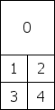
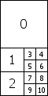

# 光照过滤
## 渲染路径和颜色空间
1. Unity光影效果可以通过设置渲染路径和颜色空间；
2. 渲染路径：计算光照的着色方式；
  - forward:着色时根据对应影响的灯光，每个光源着色一次，多个光源作用时会着色多次；
  - 优点：快速，硬件要求低，快速的处理透明；
  - 缺点：每个光源都要有对应的成本，大量光源反而降低；
  - Deferred：延迟渲染路径，将光的颜色着色到几何缓冲器，生成一个屏幕空间的贴图，大量
realtime光源模式的时候更真实，需要硬件水平要求高；
  - Legacy Vertex Lit:顶点照明，所有的光照只会在顶点上计算，速度快，最广泛的硬件支持。
但是不支持阴影，法线贴图，灯光遮罩，高精度的高光等；
  - Legacy Defferred:和Defferfed类似，但是是不一样的算法；
  - Edit --> ProjectSerring Player --> Inspector --> Other Setting --> Rendering Path;
3. 颜色空间：色彩空间决定采用哪种算法计算照明或材质加载时候的颜色混合；
  - Linear 颜色空间
  - Camma 颜色空间
  - Edit --> ProjectSetting Player --> Inspector --> Other Setting --> Rendering Path

## Cookies
1. 设置一下导入的纹理，在纹理属性的面板上选择Cookies
   - 配置好Cookies 对应的光源类型；
   - 可勾选住Alpha from Grayscale选项；
2. 在平行光源中只要把一张带着透明通道的纹理图或者灰度图拖动到光源上的Cookies上

## 镜头光晕
1. 镜头光晕又叫耀斑，模拟摄像机镜头内的一种光线折射的效果；
2. 耀斑的制作：creator --> Lens Flare 来制作一个耀斑，一般由美术和特效人员完成；
3. 耀斑的使用：
   - 打开光源组件，将耀斑文件拖入到光源的Flare选项里面；
   - 物体中添加耀斑组件Lens Flare,然后关联耀斑文件资源；
   - 光晕必须朝向摄像机
4. 
  - 1 Large 4 Small 
  - 、
  - 1 Large 2 Medium 8 Small
  - 
	